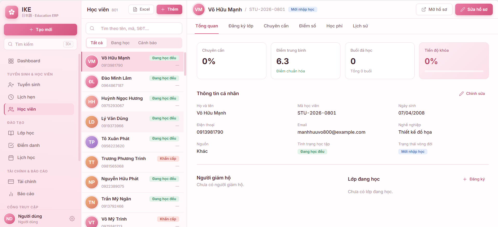

# Education ERP

Phần mềm quản lý trung tâm giáo dục (Education ERP) cho IKE Ohashi — xây trên **Frappe Framework** với giao diện **SPA Vue 3 + frappe-ui**.



## Tính năng chính

- **Tuyển sinh & CRM**: quản lý lead, lịch hẹn, tư vấn, test xếp lớp, pipeline chuyển stage có tác vụ.
- **Đào tạo**: lớp học, lịch học tự sinh theo template, điểm danh theo buổi, tiến độ lớp.
- **Học viên**: hồ sơ, người giám hộ, thẻ học viên, bảo lưu/chuyển lớp, chuyên cần & điểm trung bình.
- **Tài chính**: học phí, hóa đơn, thu/hoàn tiền, bảng lương giáo viên, công nợ.
- **Cổng truy cập**: cổng giáo viên & cổng học viên riêng.
- **Dashboard** trực quan + **trợ lý AI** (proxy Groq, OpenAI-compatible).

## Cài đặt

Dùng [bench](https://github.com/frappe/bench) CLI:

```bash
cd $PATH_TO_YOUR_BENCH
bench get-app https://github.com/nguyentrieu210/edu --branch main
bench install-app edu
```

Frontend SPA được build sẵn trong `edu/public/frontend`. Build lại khi cần:

```bash
cd apps/edu/frontend
yarn install && yarn build
```

## Công nghệ

- Backend: Frappe Framework (Python), Postgres/MariaDB
- Frontend: Vue 3, Vite, frappe-ui
- AI: Groq (OpenAI-compatible API), cấu hình `groq_api_key` trong `site_config.json`

## Đóng góp

App dùng `pre-commit` để format & lint. [Cài pre-commit](https://pre-commit.com/#installation) rồi bật cho repo:

```bash
cd apps/edu
pre-commit install
```

Công cụ: ruff, eslint, prettier, pyupgrade.

## License

MIT
