# Education ERP - Đặc tả Workflow và Kiến trúc hệ thống

> Trạng thái: Implementation-ready specification  
> Kiến trúc mục tiêu: Frappe modular monolith + Vue SPA  
> Phạm vi: Tuyển sinh, đào tạo, lớp học, học phí, portal và báo cáo

## 1. Mục tiêu

Tài liệu này mô tả luồng vận hành mục tiêu của WebApp Tiếng Nhật IKE, từ khâu xây dựng chương trình học, tuyển sinh, xếp lớp, vận hành từng buổi học, quản lý học phí đến theo dõi tiến độ.

Hệ thống phục vụ ba nhóm người dùng:

| Vai trò | Trách nhiệm chính |
|---|---|
| Admin/Giáo vụ | Quản lý chương trình, học viên, giáo viên, lớp, học phí và báo cáo |
| Giáo viên | Xem lịch dạy, vận hành buổi học, điểm danh, nhập điểm và giao bài |
| Học viên | Theo dõi lịch học, điểm số, nhận xét, bài tập, tiến độ và công nợ |

### 1.1. Phạm vi

**Trong phạm vi**

- Quản lý chương trình, khóa học và kế hoạch bài giảng.
- Quản lý học viên, người giám hộ, giáo viên và lớp.
- Đăng ký học, chuyển lớp, bảo lưu, học lại và nghỉ học.
- Sinh lịch, vận hành buổi học, điểm danh, đánh giá và homework.
- Lịch thu, hóa đơn, phiếu thu, hoàn tiền và công nợ.
- Portal theo vai trò, báo cáo, cảnh báo và thông báo.

**Ngoài phạm vi giai đoạn đầu**

- Kế toán sổ cái tổng hợp.
- Ngân hàng tự động đối soát.
- Học trực tuyến có video conference tích hợp.
- Chấm bài tự động bằng AI.

### 1.2. Thuật ngữ chuẩn

| Thuật ngữ | Ý nghĩa |
|---|---|
| Course | Sản phẩm/khóa học, ví dụ N5 cấp tốc |
| Curriculum | Cấu trúc nội dung chuẩn của Course |
| Class | Một lớp mở thực tế từ Course |
| Class Session | Một buổi học cụ thể của Class |
| Program Enrollment | Một lần học viên đăng ký vào Class |
| Teaching Assignment | Phân công giáo viên cho Class hoặc Session |
| Fee Schedule | Nghĩa vụ/lịch thu phát sinh từ Enrollment |
| Fee Invoice | Chứng từ phải thu |
| Fee Payment | Chứng từ ghi nhận tiền đã thu |
| Portal | Giao diện theo phạm vi dữ liệu của một vai trò |

### 1.3. Hai loại trạng thái bắt buộc phải tách riêng

Frappe sử dụng `docstatus` cho vòng đời chứng từ:

| `docstatus` | Ý nghĩa |
|---:|---|
| 0 | Draft - còn có thể chỉnh sửa |
| 1 | Submitted - đã xác nhận, không sửa trực tiếp |
| 2 | Cancelled - đã hủy |

Trạng thái nghiệp vụ phải nằm ở field riêng, ví dụ `enrollment_status`, `session_status`, `invoice_status`. Không dùng giá trị nghiệp vụ để thay thế `docstatus`.

### 1.4. Các bất biến dữ liệu

1. Một học viên không có hai Enrollment đang hoạt động trong cùng một Class.
2. Attendance là duy nhất theo `program_enrollment + class_session`.
3. Một Class Session không được trùng phòng hoặc giáo viên trong cùng khoảng thời gian.
4. Tổng phân bổ của Payment phải bằng số tiền Payment.
5. Tổng phân bổ vào Invoice không được vượt số tiền còn nợ.
6. Chứng từ đã submit chỉ được Cancel/Amend, không sửa hoặc xóa trực tiếp.
7. Giá học phí của Enrollment được lưu snapshot và không thay đổi khi giá Course/Class thay đổi sau đó.
8. Giáo viên và học viên chỉ được truy cập dữ liệu nằm trong phạm vi được phân công.

---

## 2. Luồng vận hành tổng thể

```mermaid
flowchart LR
    A["1. Biên soạn chương trình học"]
    B["2. Quản lý học viên và giáo viên"]
    C["3. Tạo lớp và gắn chương trình"]
    D["4. Gán giáo viên vào lớp"]
    E["5. Tạo và duyệt đăng ký lớp"]
    F["6. Chốt giá và sinh lịch thu"]
    G["7. Sinh lịch buổi học"]
    H["8. Giáo viên điểm danh"]
    I["9. Ghi nhận đánh giá/nhận xét khi có"]
    J["10. Học viên xem portal"]
    K["11. Admin theo dõi báo cáo"]

    A --> B --> C --> D --> E --> F --> G --> H --> I --> J --> K
```

### Điều kiện để luồng chạy xuyên suốt

1. Khóa học phải có chương trình và cấu phần học tập.
2. Lớp phải liên kết với khóa học, giáo viên và lịch học.
3. Học viên phải có đăng ký lớp ở trạng thái đã duyệt.
4. Enrollment phải lưu snapshot học phí trước khi sinh lịch thu.
5. Lịch thu phải sinh hóa đơn đã submit trước khi thu tiền.
6. Buổi học phải tồn tại trước khi giáo viên điểm danh hoặc nhập nội dung.
7. Giáo viên và học viên phải có tài khoản, vai trò và phạm vi dữ liệu riêng.

---

## 3. Workflow Admin/Giáo vụ

### 3.1. Biên soạn chương trình học

Admin tạo một chương trình như N5, N4, N3 hoặc khóa luyện thi. Mỗi chương trình gồm:

- Thông tin khóa học: tên, cấp độ, mô tả, học phí cơ bản.
- Số buổi và thời lượng mỗi buổi.
- Kanji.
- Từ vựng.
- Ngữ pháp.
- Đọc hiểu.
- Nghe hiểu.
- Kaiwa.
- JLPT/BJT practice.
- Homework, tài liệu và mini test.

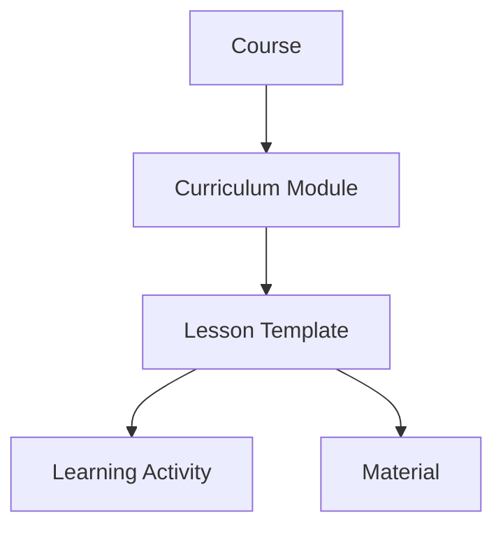

### 3.2. Quản lý học viên

Admin quản lý:

- Hồ sơ cá nhân và người giám hộ.
- Trình độ đầu vào.
- Lớp hiện tại và lịch sử lớp.
- Trạng thái vòng đời: mới nhập học, đang học, bảo lưu, tốt nghiệp, nghỉ học.
- Điểm trung bình, chuyên cần và cảnh báo học tập.
- Lịch sử học phí và công nợ.

### 3.3. Quản lý giáo viên

Hồ sơ giáo viên cần có:

- Thông tin cá nhân và tài khoản đăng nhập.
- Chuyên môn, cấp độ có thể giảng dạy.
- Lớp phụ trách.
- Lịch dạy.
- Trạng thái hoạt động.
- Đơn giá theo buổi hoặc chính sách lương.

### 3.4. Tạo và cấu hình lớp

Một lớp cần tối thiểu:

| Nhóm dữ liệu | Nội dung |
|---|---|
| Nhận diện | Mã lớp, tên lớp, trạng thái |
| Đào tạo | Khóa học, chương trình, tổng số buổi |
| Nhân sự | Giáo viên chính, giáo viên thay thế |
| Lịch | Ngày khai giảng, thứ học, giờ bắt đầu/kết thúc |
| Vận hành | Phòng học, sĩ số tối đa |
| Tài chính | Học phí chuẩn, kỳ thu |

#### Quy tắc kế thừa học phí

Hệ thống dùng thứ tự ưu tiên:

```text
Giá thỏa thuận trên Enrollment
    > Giá riêng của Class
    > Base Fee của Course
```

Khi Enrollment được submit, hệ thống lưu snapshot:

- `list_price`: giá trước ưu đãi.
- `discount_type`: phần trăm hoặc số tiền.
- `discount_value`: giá trị ưu đãi.
- `discount_reason`: lý do và người duyệt.
- `net_fee`: học phí cuối cùng.
- `installment_plan`: kế hoạch chia kỳ.
- `currency`: mặc định VND.

Mọi Fee Schedule và Invoice về sau phải lấy từ snapshot này, không đọc lại giá hiện tại của Course/Class.

### 3.5. Gán giáo viên vào lớp

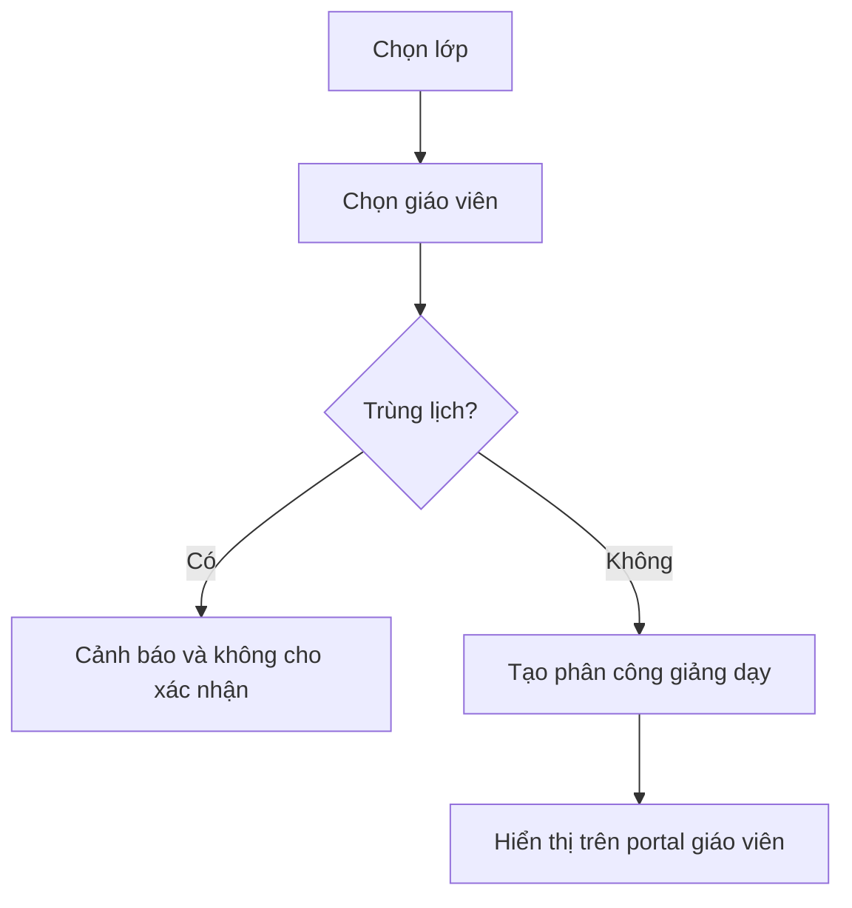

### 3.6. Gán học viên vào lớp

Gán học viên phải tạo một bản ghi đăng ký học và đưa qua trạng thái duyệt.

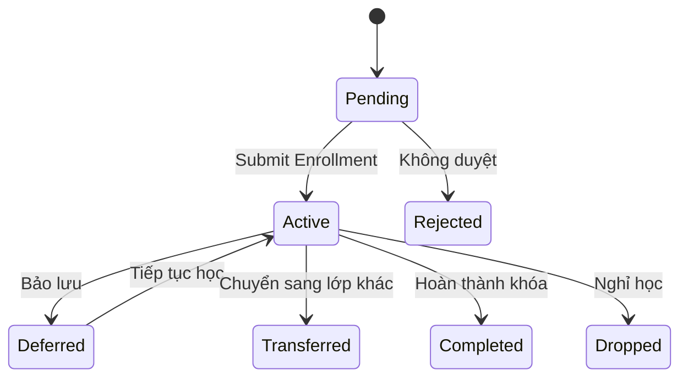

`Program Enrollment.docstatus` chỉ dùng `Draft/Submitted/Cancelled`. Sơ đồ trên mô tả field `enrollment_status`.

Khi đăng ký được duyệt, hệ thống thực hiện:

1. Thêm học viên vào danh sách lớp.
2. Sinh checklist onboarding.
3. Tạo lịch thu học phí.
4. Cập nhật lớp hiện tại của học viên.
5. Cấp quyền xem dữ liệu lớp trên portal.

#### Quy tắc duyệt Enrollment

- Class đang ở trạng thái cho phép tuyển sinh.
- Không vượt sĩ số tối đa, trừ khi người có quyền override xác nhận.
- Không tạo Enrollment trùng đang hoạt động.
- Học viên đáp ứng điều kiện đầu vào hoặc có override được ghi audit.
- Giá, ưu đãi và kế hoạch thanh toán đã được chốt.
- Mọi tác vụ phát sinh chạy trong một transaction; lỗi ở bất kỳ bước nào phải rollback toàn bộ.

### 3.7. Quản lý học phí

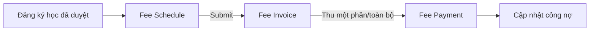

#### Nguồn và vòng đời dữ liệu tài chính

1. Enrollment đã submit cung cấp `net_fee` và kế hoạch chia kỳ.
2. Hệ thống tạo một hoặc nhiều Fee Schedule có tổng bằng `net_fee`.
3. Submit Fee Schedule tạo Fee Invoice tương ứng.
4. Chỉ Invoice `docstatus = 1` mới được thu tiền.
5. Payment submit cập nhật công nợ trong cùng transaction.
6. Payment bị hủy phải hoàn nguyên công nợ.
7. Mọi giảm giá sau submit phải qua quy trình Credit Note/Amend, không sửa trực tiếp Invoice.

Trạng thái hóa đơn:

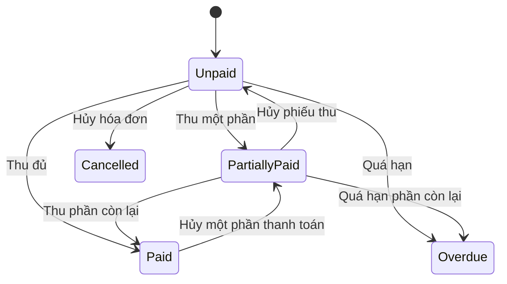

`Overdue` là trạng thái được scheduler tính từ `due_date`, không phải trạng thái người dùng nhập thủ công.

### 3.8. Sinh lịch học

Lịch học được sinh từ:

- Ngày khai giảng.
- Mẫu thứ học: 2-4-6, 3-5-7, cuối tuần hoặc tùy chỉnh.
- Giờ bắt đầu/kết thúc.
- Tổng số buổi.
- Ngày nghỉ và lịch học bù.

Mỗi buổi học phải có:

- Lớp, ngày và giờ.
- Giáo viên.
- Phòng học.
- Chủ đề/bài học.
- Trạng thái: dự kiến, đang học, hoàn thành, hủy, học bù.
- Liên kết Lesson Plan để biết nội dung dự kiến và nội dung thực tế.
- Người tạo, người sửa cuối và lịch sử thay đổi.

#### Kiểm tra xung đột lịch

Trước khi tạo hoặc đổi lịch, backend phải kiểm tra:

- Giáo viên có Session khác bị giao nhau.
- Phòng học có booking/session khác bị giao nhau.
- Class có hai Session bị giao nhau.
- Ngày nghỉ trung tâm hoặc ngày giáo viên không khả dụng.

Khoảng thời gian được coi là trùng khi:

```text
new_start < existing_end AND new_end > existing_start
```

---

## 4. Workflow vận hành lớp

### 4.1. Cấu trúc một lớp

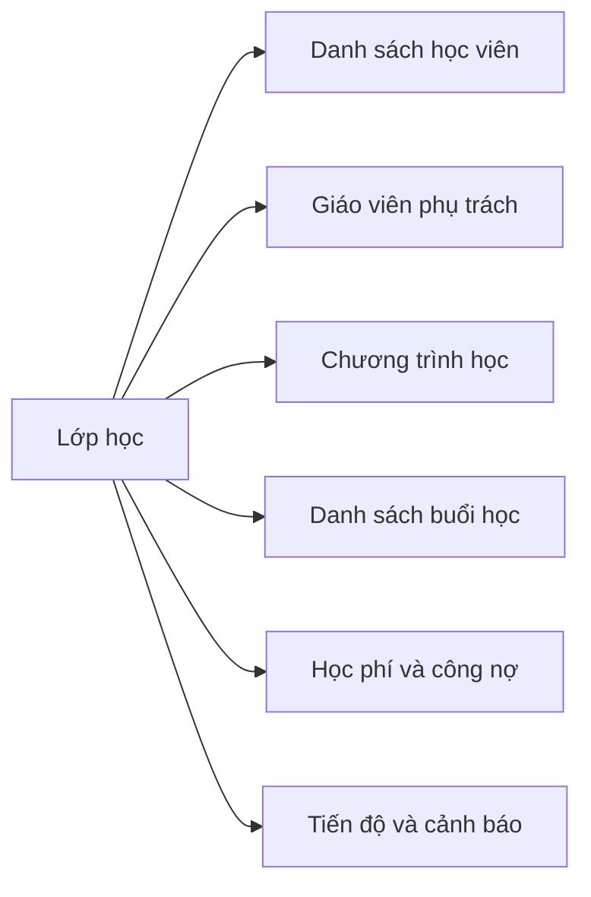

### 4.2. Vòng đời buổi học

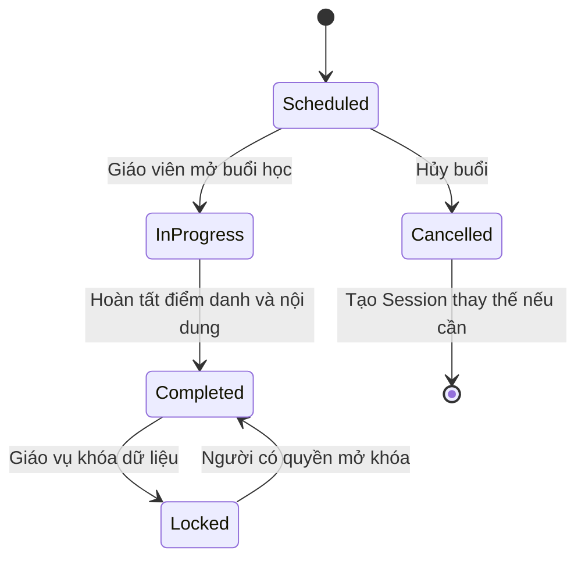

Đổi lịch không làm Session cũ quay lại `Scheduled`. Session cũ giữ trạng thái `Cancelled`; Session thay thế là bản ghi mới có `session_type = Make-up/Rescheduled` và tham chiếu `replaces_session`.

### 4.3. Tính tiến độ lớp

```text
Tiến độ lớp (%) = Số buổi đã hoàn thành / Tổng số buổi kế hoạch * 100
```

Ví dụ: đã hoàn thành 8 trên 30 buổi thì tiến độ là 26,67%.

---

## 5. Workflow Giáo viên

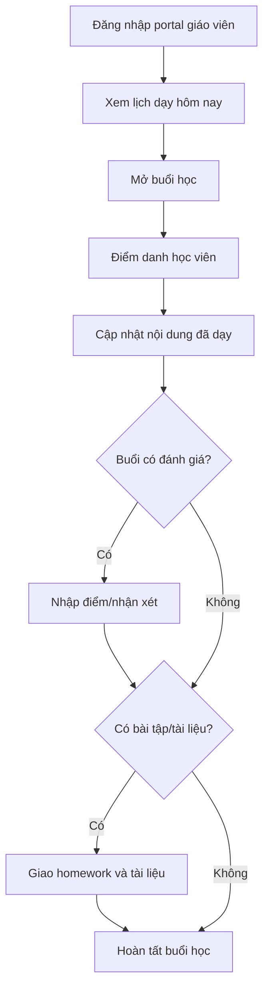

Điều kiện bắt buộc để hoàn tất Session:

- Đã lưu điểm danh cho tất cả Enrollment hoạt động tại buổi đó.
- Đã cập nhật nội dung thực tế đã dạy.
- Không còn lỗi dữ liệu hoặc xung đột chưa xử lý.

Điểm số, nhận xét cá nhân, homework và tài liệu là tùy chọn theo Lesson Plan.

### 5.1. Điểm danh

Các trạng thái đề xuất:

- Có mặt.
- Vắng có phép.
- Vắng không phép.
- Đi muộn.

Loại tham dự được lưu riêng:

- Chính khóa.
- Học bù.
- Học thử.

Hệ thống phải ngăn tạo nhiều bản ghi điểm danh cho cùng:

```text
Program Enrollment + Class Session
```

Attendance tối thiểu gồm:

- `program_enrollment`.
- `class_session`.
- `student` và `class_id` dưới dạng dữ liệu truy vấn nhanh.
- `attendance_status`: Present, Excused Absence, Unexcused Absence, Late.
- `attendance_type`: Regular, Make-up, Trial.
- `minutes_late`, ghi chú và người ghi nhận.

Sau khi lưu, hệ thống cập nhật:

- Tỷ lệ chuyên cần.
- Số buổi vắng.
- Cảnh báo học tập.
- Dashboard lớp và hồ sơ học viên.

Chỉ Attendance của Session đã hoàn thành mới được đưa vào báo cáo chuyên cần chính thức.

### 5.2. Nhập điểm và nhận xét

Điểm nên được phân loại theo:

- Kanji.
- Từ vựng.
- Ngữ pháp.
- Đọc hiểu.
- Nghe hiểu.
- Kaiwa.
- Homework.
- JLPT mini test.
- BJT practice.

Mỗi kết quả gồm:

- Program Enrollment và học viên.
- Lớp và buổi học.
- Loại đánh giá.
- Điểm tối đa và điểm đạt được.
- Trọng số trong điểm trung bình.
- Nhận xét.
- Người nhập và thời điểm nhập.

Điểm phần trăm được chuẩn hóa:

```text
normalized_score = score / max_score * 100
```

Điểm trung bình có trọng số:

```text
weighted_average = SUM(normalized_score * weight) / SUM(weight)
```

### 5.3. Homework và tài liệu

Giáo viên có thể:

- Giao bài chung cho lớp.
- Giao bài riêng cho học viên.
- Đính kèm file hoặc đường dẫn.
- Đặt hạn nộp.
- Chấm trạng thái hoàn thành.
- Gửi tài liệu ôn tập.

Homework cần hỗ trợ trạng thái `Draft`, `Published`, `Closed`, `Cancelled`. Chỉ Homework đã publish mới hiển thị trên portal học viên.

---

## 6. Workflow Học viên

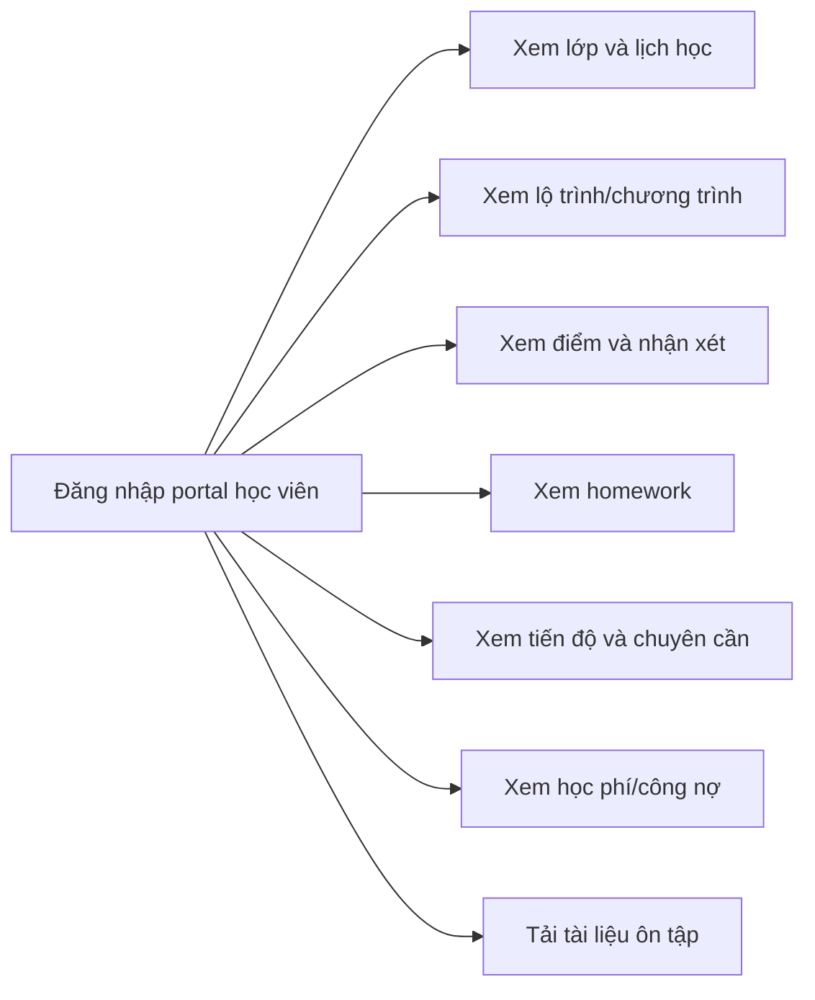

Portal chỉ hiển thị dữ liệu thuộc học viên đang đăng nhập. Học viên không được xem hoặc sửa dữ liệu của người khác.

---

## 7. Kiến trúc chức năng

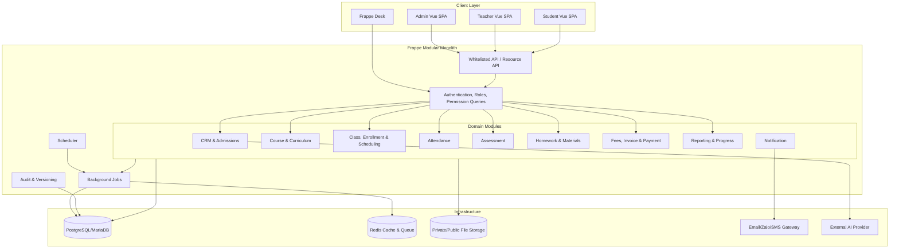

Các khối CRM, Education, Class, Attendance, Assessment, Finance... là module logic trong cùng một ứng dụng Frappe. Chúng không phải microservice triển khai độc lập.

### Nguyên tắc kiến trúc

1. Vue SPA chỉ xử lý giao diện và gọi API.
2. Quy tắc nghiệp vụ, phân quyền và giao dịch tài chính phải nằm ở backend.
3. Không dùng `ignore_permissions=True` trong API người dùng thông thường.
4. API danh sách phải áp dụng quyền theo vai trò và phạm vi dữ liệu.
5. Các thao tác nhiều bước phải chạy trong một transaction.
6. Không lưu API key hoặc secret trong frontend/bundle public.
7. Mọi thay đổi học phí, điểm số và điểm danh phải có dấu vết kiểm toán.
8. Tác vụ chậm như gửi thông báo, tổng hợp báo cáo và tạo hàng loạt Session phải chạy qua background job.
9. Tác vụ định kỳ như đánh dấu hóa đơn quá hạn và tạo cảnh báo dùng Frappe Scheduler.
10. File chứa thông tin cá nhân hoặc bài nộp phải là private file và kiểm tra quyền khi tải.
11. API bên ngoài phải có timeout, retry có giới hạn và không làm hỏng transaction nghiệp vụ chính.

### 7.1. Ranh giới module

| Module | Sở hữu dữ liệu | Không được làm trực tiếp |
|---|---|---|
| CRM & Admissions | Lead, tư vấn, test đầu vào | Tạo Payment |
| Course & Curriculum | Course, module, lesson template | Sửa Enrollment |
| Class & Scheduling | Class, Enrollment, Session, assignment | Ghi sổ công nợ |
| Attendance | Attendance và chỉ số chuyên cần | Sửa Session đã khóa |
| Assessment | Assessment, điểm tổng hợp | Sửa dữ liệu tài chính |
| Homework & Materials | Homework, submission, material | Mở quyền ngoài Enrollment |
| Finance | Fee Schedule, Invoice, Payment, Refund | Sửa điểm học tập |
| Reporting | Read model, snapshot, dashboard | Thay đổi chứng từ nguồn |

### 7.2. Giao dịch đồng bộ và tác vụ bất đồng bộ

**Phải đồng bộ trong transaction**

- Submit Enrollment, lưu snapshot học phí, tạo onboarding và Fee Schedule.
- Submit Payment và cập nhật công nợ.
- Cancel Payment và hoàn nguyên công nợ.
- Chuyển lớp và đóng/mở Enrollment liên quan.

**Có thể chạy bất đồng bộ sau commit**

- Gửi thông báo.
- Sinh PDF hóa đơn.
- Tính lại dashboard diện rộng.
- Đồng bộ dữ liệu sang hệ thống ngoài.
- Phân tích/cảnh báo bằng AI.

---

## 8. Mô hình dữ liệu đề xuất

```mermaid
erDiagram
    USER ||--o| STUDENT : "maps to"
    USER ||--o| TEACHER : "maps to"
    GUARDIAN ||--o{ STUDENT : supervises
    COURSE ||--o{ CURRICULUM_MODULE : contains
    CURRICULUM_MODULE ||--o{ LESSON_TEMPLATE : contains
    COURSE ||--o{ CLASS : opens
    TEACHER ||--o{ TEACHING_ASSIGNMENT : receives
    CLASS ||--o{ TEACHING_ASSIGNMENT : has
    STUDENT ||--o{ PROGRAM_ENROLLMENT : enrolls
    CLASS ||--o{ PROGRAM_ENROLLMENT : includes
    CLASS ||--o{ CLASS_SESSION : schedules
    PROGRAM_ENROLLMENT ||--o{ STUDENT_ATTENDANCE : owns
    CLASS_SESSION ||--o{ STUDENT_ATTENDANCE : records
    STUDENT ||--o{ STUDENT_ATTENDANCE : receives
    PROGRAM_ENROLLMENT ||--o{ STUDENT_ASSESSMENT : owns
    CLASS_SESSION ||--o{ STUDENT_ASSESSMENT : evaluates
    STUDENT ||--o{ STUDENT_ASSESSMENT : receives
    CLASS_SESSION ||--o{ HOMEWORK : assigns
    HOMEWORK ||--o{ HOMEWORK_SUBMISSION : receives
    PROGRAM_ENROLLMENT ||--o{ HOMEWORK_SUBMISSION : owns
    STUDENT ||--o{ HOMEWORK_SUBMISSION : submits
    PROGRAM_ENROLLMENT ||--o{ FEE_SCHEDULE : creates
    FEE_SCHEDULE ||--o{ FEE_INVOICE : creates
    FEE_INVOICE ||--o{ FEE_PAYMENT_REFERENCE : allocated_by
    FEE_PAYMENT ||--o{ FEE_PAYMENT_REFERENCE : contains
```

### DocType hiện có có thể tái sử dụng

- Student, Guardian, Teacher.
- Course, Class, Class Session.
- Program Enrollment.
- Student Attendance, Student Assessment.
- Fee Schedule, Fee Invoice, Fee Payment.
- Onboarding Task, Student Card.

### DocType nên bổ sung

- Curriculum Module.
- Lesson Template/Lesson Plan.
- Teaching Assignment.
- Homework.
- Homework Submission.
- Learning Material.
- Teacher Comment.
- Progress Snapshot.
- Notification Log.

### 8.1. Khóa duy nhất và chỉ mục bắt buộc

| DocType | Unique/Index |
|---|---|
| Program Enrollment | Index `(student, class_id, enrollment_status)`; kiểm tra duy nhất bằng backend |
| Class Session | Unique `(class_id, session_date, start_time)` |
| Student Attendance | Unique `(program_enrollment, class_session)` |
| Student Assessment | Index `(program_enrollment, class_session, assessment_type)` |
| Homework Submission | Unique `(homework, program_enrollment)` |
| Fee Payment Reference | Index `(invoice, parent)` |
| Teaching Assignment | Index `(teacher, from_date, to_date)` |

### 8.2. Snapshot và lịch sử

- Enrollment lưu snapshot học phí và điều kiện thương mại.
- Class Session lưu snapshot giáo viên, phòng và Lesson Plan tại thời điểm học.
- Assessment lưu `max_score`, `weight` và loại đánh giá tại thời điểm chấm.
- Progress Snapshot lưu kết quả tổng hợp theo ngày để báo cáo không phụ thuộc dữ liệu hiện tại.
- Dùng Frappe Version hoặc Audit Log cho các field nhạy cảm.

---

## 9. Phân quyền

| Chức năng | Admin/Giáo vụ | Kế toán | Giáo viên | Học viên |
|---|---|---|---|---|
| Chương trình | Tạo, đọc, sửa | Đọc | Đọc lớp được giao | Đọc chương trình đang học |
| Học viên | Tạo, đọc, sửa | Đọc thông tin cần thiết | Đọc học viên trong lớp | Chỉ hồ sơ bản thân |
| Giáo viên | Tạo, đọc, sửa | Không | Hồ sơ bản thân | Không |
| Class/Enrollment | Tạo, duyệt, chuyển, bảo lưu | Đọc | Đọc lớp được giao | Đọc lớp đang học |
| Session | Tạo, đổi lịch, khóa | Không | Mở và hoàn tất buổi được giao | Đọc lịch của mình |
| Attendance | Quản lý/mở khóa | Không | Ghi lớp được giao | Đọc bản thân |
| Assessment | Quản lý/mở khóa | Không | Ghi lớp được giao | Đọc bản thân |
| Homework | Quản lý | Không | Tạo/publish lớp được giao | Đọc/nộp bài bản thân |
| Fee Schedule | Tạo/submit/cancel | Tạo/submit/cancel | Không | Đọc bản thân |
| Invoice | Submit/cancel/amend | Submit/cancel/amend | Không | Đọc bản thân |
| Payment/Refund | Đọc | Submit/cancel/amend | Không | Đọc bản thân |
| Báo cáo | Toàn hệ thống | Tài chính | Lớp được giao | Tiến độ bản thân |

### 9.1. Quy tắc quyền dữ liệu

- Giáo viên chỉ thấy Class có Teaching Assignment hiệu lực.
- Giáo viên chỉ thấy Student có Enrollment hoạt động trong Class được giao.
- Học viên được ánh xạ từ `frappe.session.user` tới đúng một Student.
- Kế toán không mặc nhiên được xem nhận xét học tập hoặc dữ liệu sức khỏe không cần thiết.
- API danh sách phải dùng permission query hoặc truy vấn có điều kiện phạm vi; không chỉ ẩn menu ở frontend.
- Tải file phải kiểm tra quyền của document được đính kèm.

### 9.2. Quy tắc chứng từ tài chính

- Draft: có thể sửa hoặc xóa nếu có quyền.
- Submitted: không sửa/xóa; chỉ Cancel hoặc Amend.
- Cancelled: chỉ đọc và tạo bản amend.
- Mọi Cancel/Amend phải lưu lý do, người thực hiện và thời điểm.

---

## 10. Workflow ngoại lệ

### 10.1. Chuyển lớp

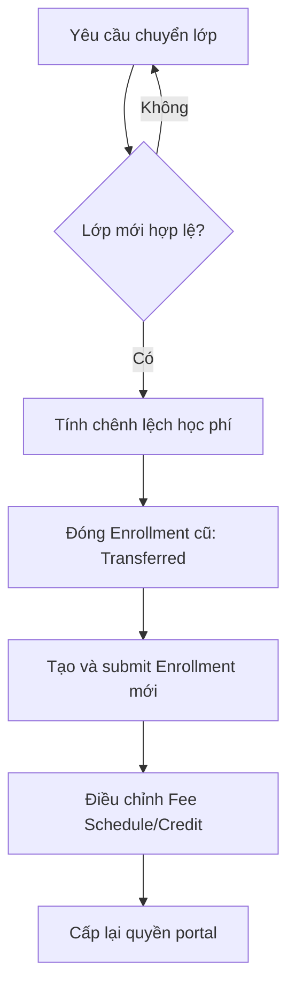

Quy tắc:

- Attendance, Assessment và Payment cũ giữ nguyên liên kết Enrollment cũ.
- Không chuyển dữ liệu lịch sử sang Enrollment mới.
- Tiến độ có thể được quy đổi bằng `recognized_sessions` hoặc mapping Lesson Plan.
- Chênh lệch học phí phải sinh Debit/Credit adjustment, không sửa Invoice đã submit.
- Toàn bộ bước đóng Enrollment cũ và tạo Enrollment mới chạy trong một transaction.

### 10.2. Bảo lưu và học lại

- Enrollment chuyển sang `Deferred`, lưu ngày bắt đầu, ngày dự kiến quay lại và lý do.
- Không sinh nghĩa vụ điểm danh mới trong thời gian bảo lưu.
- Portal vẫn cho xem lịch sử nhưng ẩn tác vụ của lớp sau ngày bảo lưu.
- Chính sách học phí xác định rõ: giữ nguyên, chuyển kỳ, hoặc tạo credit.
- Khi học lại, có thể kích hoạt Enrollment cũ nếu trở lại cùng lớp hoặc tạo Enrollment mới nếu sang lớp khác.

### 10.3. Nghỉ học và hoàn tiền

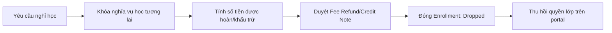

- Không xóa Enrollment, Attendance, Assessment hoặc chứng từ tài chính.
- Công thức hoàn tiền phải cấu hình được và lưu snapshot tại thời điểm duyệt.
- Refund chỉ được submit bởi vai trò tài chính có thẩm quyền.

### 10.4. Hủy buổi và học bù

- Session cũ chuyển `Cancelled`, lưu lý do và người hủy.
- Tạo Session mới có `session_type = Make-up` và `replaces_session`.
- Attendance của Session bị hủy không được tính chuyên cần.
- Hệ thống gửi thông báo thay đổi lịch sau khi transaction thành công.

### 10.5. Giáo viên thay thế

- Tạo Teaching Assignment theo Session hoặc khoảng thời gian.
- Giữ giáo viên chính trên Class và lưu giáo viên thực dạy trên Session.
- Kiểm tra trùng lịch giáo viên thay thế.
- Lương giáo viên tính theo giáo viên thực dạy và Session đã hoàn thành.

### 10.6. Lỗi giữa quy trình nhiều bước

| Quy trình | Yêu cầu rollback |
|---|---|
| Submit Enrollment | Không để lại task, Fee Schedule hoặc quyền portal rác |
| Submit Payment | Không tạo Payment nếu cập nhật Invoice thất bại |
| Chuyển lớp | Không đóng Enrollment cũ nếu Enrollment mới thất bại |
| Sinh lịch | Không xóa lịch cũ trước khi lịch mới được kiểm tra hợp lệ |
| Publish Homework | Không gửi thông báo nếu publish thất bại |

### 10.7. Xử lý trùng dữ liệu

- Student trùng được phát hiện theo email, điện thoại và thông tin định danh.
- Không tự động merge chứng từ tài chính.
- Merge phải có màn hình đối chiếu, quyền riêng và audit log.
- Lead chuyển đổi nhiều lần phải trả lại Student đã liên kết thay vì tạo Student mới.

---

## 11. Báo cáo và cảnh báo

### Dashboard Admin

- Tổng số học viên đang học.
- Lớp đang vận hành/sắp khai giảng.
- Tỷ lệ chuyên cần theo lớp.
- Điểm trung bình theo lớp và kỹ năng.
- Học viên cần theo dõi.
- Doanh thu đã thu và công nợ.
- Hóa đơn quá hạn.
- Tình trạng hoàn thành chương trình.

### Định nghĩa chỉ số

| Chỉ số | Công thức |
|---|---|
| Tiến độ lớp | Session Completed / Tổng Session kế hoạch |
| Chuyên cần | Session có mặt hợp lệ / Session phải tham dự |
| Điểm trung bình | Trung bình có trọng số của normalized score |
| Công nợ | Tổng Invoice submitted - Payment submitted phân bổ |
| Doanh thu đã thu | Tổng Payment submitted, loại trừ Payment cancelled/refunded |
| Sĩ số hiện tại | Enrollment có status Active tại ngày báo cáo |

### Dashboard Giáo viên

- Lịch dạy hôm nay.
- Buổi chưa hoàn tất điểm danh.
- Bài kiểm tra chưa nhập điểm.
- Homework sắp đến hạn.
- Học viên vắng nhiều hoặc điểm giảm.

### Dashboard Học viên

- Buổi hiện tại/tổng số buổi.
- Điểm trung bình.
- Tỷ lệ chuyên cần.
- Bài tập sắp đến hạn.
- Nhận xét mới.
- Học phí còn lại.

### Quy tắc cảnh báo mẫu

| Điều kiện | Mức cảnh báo |
|---|---|
| Vắng 1 buổi gần nhất | Cần theo dõi |
| Vắng 2 buổi liên tiếp | Cảnh báo |
| Vắng từ 3 buổi liên tiếp | Khẩn cấp |
| Điểm trung bình dưới ngưỡng | Học viên yếu |
| Hóa đơn quá hạn | Cảnh báo công nợ |

Ngưỡng cảnh báo phải cấu hình trong Education Settings theo Course/Class, không hardcode trong frontend.

---

## 12. Đối chiếu với dự án hiện tại

### Đã có nền tảng

- Hồ sơ học viên, giáo viên và người giám hộ.
- Khóa học, lớp và sinh lịch học.
- Điểm danh và nhập điểm cơ bản.
- Hóa đơn, phiếu thu và công nợ.
- CRM Lead, onboarding, thẻ học viên và task nội bộ.

### Khoảng trống cần hoàn thiện

1. Chưa có giao diện tạo và submit đăng ký học viên vào lớp.
2. Chưa có portal và quyền riêng cho Giáo viên/Học viên.
3. Course chưa có cấu trúc chương trình chi tiết theo kỹ năng và từng buổi.
4. Điểm danh thiếu trạng thái đi muộn và học bù.
5. Điểm số chưa phân loại theo Kanji, từ vựng, nghe, đọc, Kaiwa...
6. Chưa có homework, bài nộp và tài liệu học tập.
7. Chưa tự động tổng hợp tiến độ, chuyên cần và điểm trung bình từ dữ liệu chi tiết.
8. Dashboard chưa có báo cáo lớp, cảnh báo học viên yếu và trạng thái chương trình.
9. Luồng hóa đơn từ giao diện cần đảm bảo hóa đơn được submit trước khi thu tiền.
10. Workflow test hiện tại cần cập nhật theo schema `Program Enrollment.class_id`.
11. Chưa có Enrollment snapshot cho học phí và điều kiện thương mại.
12. Attendance/Assessment chưa liên kết trực tiếp Program Enrollment và Class Session đầy đủ.
13. Chưa có unique constraint nghiệp vụ chống dữ liệu trùng.
14. Chưa có workflow chuyển lớp, bảo lưu, nghỉ học và điều chỉnh tài chính khép kín.

---

## 13. Thứ tự triển khai đề xuất

### Giai đoạn 1 - Khép kín luồng lõi

1. Chuẩn hóa schema Enrollment, Attendance, Assessment và Session.
2. Thêm unique constraint, index và permission query.
3. Tạo giao diện gán học viên vào lớp và chốt học phí.
4. Submit Program Enrollment trong transaction.
5. Tự sinh onboarding và lịch thu.
6. Submit hóa đơn và thu tiền.
7. Sinh lịch học có kiểm tra xung đột.
8. Điểm danh và nhập điểm theo Enrollment + Session.

**Tiêu chí hoàn tất**

- Workflow test lõi chạy xanh trên database hỗ trợ chính thức.
- Không thể tạo Enrollment/Attendance trùng.
- Không thể thu tiền trên Invoice draft.
- Giáo viên không xem được lớp ngoài phân công.

### Giai đoạn 2 - Vận hành đào tạo

1. Xây dựng Curriculum Module và Lesson Plan.
2. Cập nhật nội dung từng buổi.
3. Phân loại điểm theo kỹ năng.
4. Bổ sung homework, tài liệu và nhận xét.
5. Tự tính tiến độ, chuyên cần và cảnh báo.
6. Bổ sung chuyển lớp, bảo lưu, nghỉ học và học bù.

**Tiêu chí hoàn tất**

- Một buổi học có thể hoàn tất mà không bắt buộc có bài kiểm tra/homework.
- Lịch sử học tập không bị thay đổi khi học viên chuyển lớp.
- Báo cáo tiến độ và chuyên cần khớp dữ liệu nguồn.

### Giai đoạn 3 - Portal và báo cáo

1. Portal Giáo viên.
2. Portal Học viên.
3. Phân quyền theo lớp và người dùng.
4. Dashboard theo vai trò.
5. Thông báo lịch học, bài tập, điểm và công nợ.

**Tiêu chí hoàn tất**

- Teacher/Student portal vượt kiểm thử truy cập chéo tài khoản.
- Dashboard có định nghĩa chỉ số và truy vết được dữ liệu nguồn.
- File private không thể tải khi không có quyền.

---

## 14. Tiêu chí nghiệm thu end-to-end

Workflow được coi là hoàn chỉnh khi có thể thực hiện liên tục:

1. Admin tạo chương trình N5.
2. Admin tạo lớp, gán giáo viên và cấu hình 30 buổi.
3. Admin tạo học viên và đăng ký học viên vào lớp.
4. Hệ thống sinh onboarding, lịch thu, hóa đơn và lịch học.
5. Admin ghi nhận một phần hoặc toàn bộ học phí.
6. Giáo viên đăng nhập và chỉ thấy lớp được giao.
7. Giáo viên mở buổi học, điểm danh, nhập điểm, nhận xét và giao homework.
8. Học viên đăng nhập và chỉ thấy dữ liệu của mình.
9. Hệ thống cập nhật tiến độ, chuyên cần, điểm trung bình và cảnh báo.
10. Admin xem được báo cáo tổng hợp theo học viên, lớp, giáo viên và công nợ.

### 14.1. Kịch bản nghiệm thu bắt buộc

| ID | Given | When | Then |
|---|---|---|---|
| ENR-01 | Học viên chưa thuộc lớp, lớp còn chỗ | Submit Enrollment | Enrollment Active; task, lịch thu và quyền portal được tạo |
| ENR-02 | Học viên đã có Enrollment Active cùng lớp | Submit lần nữa | Bị từ chối, không tạo dữ liệu phụ |
| ENR-03 | Lớp đã đủ sĩ số | Submit Enrollment | Bị từ chối hoặc yêu cầu override có audit |
| SCH-01 | Giáo viên/phòng còn trống | Sinh lịch | Tạo đủ số Session đúng mẫu |
| SCH-02 | Có xung đột giáo viên/phòng | Sinh/đổi lịch | Bị từ chối và chỉ rõ Session xung đột |
| ATT-01 | Enrollment Active và Session hợp lệ | Lưu điểm danh | Tạo đúng một Attendance |
| ATT-02 | Attendance đã tồn tại | Gửi lại cùng khóa | Update có kiểm soát hoặc trả lỗi, không tạo trùng |
| ASM-01 | Session không có kiểm tra | Hoàn tất buổi | Thành công nếu điểm danh và nội dung đã đủ |
| FIN-01 | Fee Schedule submitted | Tạo Invoice | Invoice được submit và số tiền bằng snapshot Enrollment |
| FIN-02 | Invoice draft | Tạo Payment | Bị từ chối |
| FIN-03 | Hai Payment đồng thời vượt outstanding | Submit đồng thời | Chỉ giao dịch hợp lệ thành công; không âm công nợ |
| FIN-04 | Payment submitted | Cancel Payment | Công nợ được hoàn nguyên chính xác |
| TRF-01 | Enrollment Active | Chuyển lớp | Lịch sử lớp cũ giữ nguyên; Enrollment mới được tạo |
| SEC-01 | Giáo viên A đăng nhập | Truy cập lớp của giáo viên B | HTTP 403 hoặc danh sách rỗng |
| SEC-02 | Học viên A đăng nhập | Truy cập dữ liệu học viên B | HTTP 403 |
| FILE-01 | Người dùng không có quyền document | Tải private file | Bị từ chối |
| TXN-01 | Lỗi khi tạo Fee Schedule | Submit Enrollment | Toàn bộ transaction rollback |

### 14.2. Điều kiện nghiệm thu chất lượng

- 100% kịch bản P0/P1 chạy tự động và xanh.
- Không có secret trong source hoặc asset build.
- Không có API nghiệp vụ người dùng dùng `ignore_permissions=True`.
- Không có lỗi phân quyền mức nghiêm trọng/cao trong kiểm thử.
- Tất cả thay đổi tài chính, điểm và điểm danh có audit trail.
- Các chỉ số dashboard đối chiếu đúng với truy vấn dữ liệu nguồn.

---

## 15. Hợp đồng API và quy tắc tích hợp

### 15.1. Nguyên tắc API

- API command dùng `POST`; API query dùng `GET`.
- Backend tự lấy người dùng từ session, không tin `user`, `teacher` hoặc `student` do client gửi nếu có thể suy ra.
- Mọi command kiểm tra quyền và trạng thái hiện tại trước khi thay đổi dữ liệu.
- Validation nghiệp vụ trả mã lỗi ổn định để frontend dịch thông báo.
- Không gọi trực tiếp `frappe.client.set_value/insert/delete` cho workflow quan trọng.
- Không trả field nhạy cảm nếu màn hình không cần.
- Danh sách phải có pagination, filter whitelist và giới hạn page size.

### 15.2. API command đề xuất

| Command | Mục đích |
|---|---|
| `create_enrollment` | Tạo Enrollment draft và snapshot giá |
| `submit_enrollment` | Duyệt Enrollment, sinh dữ liệu phụ |
| `transfer_enrollment` | Chuyển lớp trong một transaction |
| `defer_enrollment` | Bảo lưu |
| `resume_enrollment` | Tiếp tục học |
| `drop_enrollment` | Nghỉ học và kích hoạt xử lý tài chính |
| `generate_class_sessions` | Sinh lịch sau khi kiểm tra xung đột |
| `open_class_session` | Chuyển Session sang In Progress |
| `save_session_attendance` | Lưu điểm danh hàng loạt |
| `complete_class_session` | Kiểm tra điều kiện và hoàn tất Session |
| `save_assessment_results` | Ghi điểm hàng loạt theo Assessment |
| `submit_fee_schedule` | Sinh Invoice đã submit |
| `create_payment` | Thu tiền và cập nhật công nợ |
| `cancel_payment` | Hủy thu và hoàn nguyên công nợ |

### 15.3. Cấu trúc response

```json
{
  "ok": true,
  "data": {
    "name": "ENR-2026-0001"
  },
  "meta": {
    "request_id": "req-uuid"
  }
}
```

Lỗi nghiệp vụ:

```json
{
  "ok": false,
  "error": {
    "code": "CLASS_CAPACITY_EXCEEDED",
    "message": "Lớp đã đủ sĩ số.",
    "details": {
      "class_id": "CLS-2026-0001"
    }
  },
  "meta": {
    "request_id": "req-uuid"
  }
}
```

### 15.4. Idempotency và xử lý đồng thời

- Command tài chính và submit Enrollment nhận `idempotency_key`.
- Lặp lại cùng key phải trả cùng kết quả, không tạo chứng từ thứ hai.
- Khi phân bổ Payment, backend khóa Invoice hoặc dùng cập nhật có điều kiện để tránh race condition.
- Version/timestamp được kiểm tra khi sửa Attendance, Assessment hoặc Session đã được người khác cập nhật.
- Job sinh lịch phải có khóa theo Class để không chạy đồng thời.

### 15.5. Sự kiện nghiệp vụ

| Sự kiện | Tác vụ sau commit |
|---|---|
| EnrollmentSubmitted | Gửi thông báo, refresh read model |
| ClassSessionsGenerated | Thông báo lịch mới |
| SessionCompleted | Tính tiến độ/chuyên cần |
| AssessmentPublished | Thông báo điểm |
| HomeworkPublished | Thông báo homework |
| InvoiceOverdue | Gửi cảnh báo công nợ |
| PaymentSubmitted | Gửi biên nhận |
| EnrollmentTransferred | Cập nhật quyền portal |

---

## 16. Bảo mật và bảo vệ dữ liệu

### 16.1. Dữ liệu nhạy cảm

- Thông tin cá nhân học viên/người giám hộ.
- Điểm số, nhận xét và tình trạng học tập.
- Hóa đơn, thanh toán, hoàn tiền.
- File hồ sơ, bài nộp và tài liệu nội bộ.
- API key, access token và thông tin tích hợp.

### 16.2. Kiểm soát bắt buộc

1. Phân quyền backend theo role và phạm vi bản ghi.
2. CSRF protection cho request dùng session.
3. Rate limit cho đăng nhập, upload và API AI.
4. Secret chỉ lưu trong site config/environment/secret manager.
5. Private file không có URL public cố định.
6. Log không ghi API key, cookie, mật khẩu hoặc toàn bộ dữ liệu cá nhân.
7. Export dữ liệu yêu cầu quyền riêng và được ghi audit.
8. Session hết hạn và thu hồi khi tài khoản bị vô hiệu hóa.
9. Dependency và asset build được quét secret trước khi deploy.

### 16.3. Lưu giữ và xóa dữ liệu

| Loại dữ liệu | Chính sách đề xuất |
|---|---|
| Chứng từ tài chính | Giữ theo quy định kế toán áp dụng |
| Attendance/Assessment | Giữ theo chính sách đào tạo |
| Audit log | Tối thiểu 12 tháng hoặc theo quy định |
| File tạm/upload lỗi | Tự động xóa sau thời hạn |
| Lead không chuyển đổi | Ẩn danh/xóa theo chính sách đồng ý dữ liệu |

Chính sách thời hạn chính thức phải được chủ sở hữu nghiệp vụ và pháp lý phê duyệt trước production.

---

## 17. Yêu cầu phi chức năng

### 17.1. Hiệu năng

| Tác vụ | Mục tiêu |
|---|---|
| Mở danh sách thường dùng | P95 dưới 2 giây với pagination |
| Lưu điểm danh lớp 30 học viên | Dưới 3 giây |
| Submit Payment | Dưới 3 giây, không tính tác vụ thông báo |
| Dashboard | P95 dưới 3 giây với read model/cache |
| Sinh 100 Session | Chạy job và hoàn tất dưới 60 giây |

### 17.2. Tính sẵn sàng và phục hồi

- Production có backup database và file định kỳ.
- Thực hiện restore drill tối thiểu mỗi quý.
- Mục tiêu ban đầu: RPO không quá 24 giờ, RTO không quá 4 giờ; phải được chủ hệ thống phê duyệt trước go-live.
- Background job lỗi phải retry có giới hạn và vào failed queue.
- Không retry tự động command tài chính nếu chưa có idempotency.

### 17.3. Khả năng sử dụng

- Giao diện responsive cho desktop và mobile.
- Form có validation tại client để hỗ trợ người dùng, nhưng backend vẫn là nguồn xác thực cuối.
- Hành động nguy hiểm yêu cầu xác nhận và hiển thị hậu quả.
- Trạng thái loading, empty, error và permission denied phải đầy đủ.
- Ngày giờ hiển thị theo timezone của site; dữ liệu lưu theo quy ước thống nhất.

### 17.4. Khả năng truy cập

- Điều hướng bàn phím cho workflow chính.
- Label gắn đúng với control.
- Màu không phải tín hiệu trạng thái duy nhất.
- Contrast đáp ứng tối thiểu WCAG AA cho nội dung chính.

---

## 18. Quan sát hệ thống và vận hành

### 18.1. Logging

Mỗi log nghiệp vụ quan trọng cần có:

- `request_id`.
- Người dùng.
- Command.
- DocType và document name.
- Kết quả thành công/thất bại.
- Error code.
- Thời lượng.

Không log nội dung nhạy cảm ngoài mức cần thiết.

### 18.2. Chỉ số vận hành

- Số request lỗi theo API.
- Thời gian response P50/P95/P99.
- Queue length và job failure.
- Số Payment/Enrollment submit thất bại.
- Số xung đột lịch.
- Số thông báo gửi thất bại.
- Cache hit rate cho dashboard.

### 18.3. Cảnh báo kỹ thuật

- Tỷ lệ lỗi API vượt ngưỡng.
- Worker hoặc scheduler ngừng hoạt động.
- Queue backlog kéo dài.
- Database connection gần giới hạn.
- Backup thất bại.
- Phát hiện secret trong build artifact.

### 18.4. Runbook tối thiểu

- Khôi phục backup.
- Xử lý Payment bị treo.
- Chạy lại job sinh lịch/thông báo an toàn.
- Mở khóa Session/Assessment có kiểm soát.
- Thu hồi tài khoản.
- Luân chuyển API key bị lộ.

---

## 19. Chiến lược kiểm thử

| Tầng test | Phạm vi |
|---|---|
| Unit | Công thức học phí, tiến độ, chuyên cần, điểm trung bình |
| Controller/Domain | Validate và state transition của DocType |
| API | Quyền, validation, idempotency, response code |
| Integration | Enrollment → Fee → Invoice → Payment |
| Concurrency | Hai Payment, hai Enrollment, hai job sinh lịch |
| Permission | Admin/Kế toán/Giáo viên/Học viên truy cập chéo |
| E2E | Workflow từ tạo Course đến portal và báo cáo |
| Migration | Schema/patch chạy trên dữ liệu cũ |
| Performance | Điểm danh hàng loạt, dashboard, sinh lịch |
| Security | Secret scan, dependency scan, upload/file authorization |

### Dữ liệu test chuẩn

- 2 Course.
- 3 Class, trong đó một lớp đầy sĩ số.
- 2 giáo viên có lịch giao nhau.
- 5 học viên với các trạng thái Enrollment khác nhau.
- Invoice unpaid, partially paid, paid và overdue.
- Session regular, cancelled và make-up.

### Cổng chất lượng CI

- Python compile, lint và unit test.
- Frontend lint, type/build test.
- Schema validation cho DocType JSON.
- Migration test.
- Secret scan.
- Test quyền và workflow P0/P1.

---

## 20. Definition of Done

Một tính năng chỉ được coi là hoàn thành khi:

1. Quy tắc nghiệp vụ và state transition đã được tài liệu hóa.
2. Backend kiểm tra quyền và validation đầy đủ.
3. Không dùng client để bảo vệ quy tắc nghiệp vụ.
4. Có migration/patch nếu thay đổi schema.
5. Có test cho happy path, lỗi và truy cập trái quyền.
6. Có audit cho dữ liệu nhạy cảm.
7. Có loading, empty, error và permission-denied state trên UI.
8. Không có secret hoặc dữ liệu nhạy cảm trong source/build.
9. Chỉ số/log cần thiết đã được bổ sung.
10. Tài liệu vận hành và tiêu chí rollback đã cập nhật.
11. Build, test và migration chạy xanh.
12. Product owner nghiệm thu theo kịch bản Given/When/Then.

---

## 21. Ma trận truy vết yêu cầu

| Requirement | Mô tả | Module sở hữu | Kịch bản kiểm thử |
|---|---|---|---|
| REQ-ENR-001 | Không tạo Enrollment Active trùng lớp | Class & Enrollment | ENR-02 |
| REQ-ENR-002 | Snapshot học phí không đổi sau submit | Class & Finance | FIN-01 |
| REQ-SCH-001 | Không trùng giáo viên/phòng | Scheduling | SCH-02 |
| REQ-ATT-001 | Một Attendance cho Enrollment + Session | Attendance | ATT-01, ATT-02 |
| REQ-ASM-001 | Session không bắt buộc có Assessment | Assessment | ASM-01 |
| REQ-FIN-001 | Không thu tiền trên Invoice draft | Finance | FIN-02 |
| REQ-FIN-002 | Không âm công nợ khi submit đồng thời | Finance | FIN-03 |
| REQ-FIN-003 | Cancel Payment hoàn nguyên công nợ | Finance | FIN-04 |
| REQ-TRF-001 | Chuyển lớp không làm mất lịch sử | Enrollment | TRF-01 |
| REQ-SEC-001 | Giáo viên chỉ thấy lớp được giao | Authorization | SEC-01 |
| REQ-SEC-002 | Học viên chỉ thấy dữ liệu bản thân | Authorization | SEC-02 |
| REQ-FILE-001 | Private file kiểm tra quyền document | File/Authorization | FILE-01 |
| REQ-TXN-001 | Quy trình nhiều bước rollback toàn bộ | Domain Transaction | TXN-01 |

Mọi pull request triển khai yêu cầu nghiệp vụ phải tham chiếu ít nhất một Requirement ID và test tương ứng.

---

## 22. Decision register trước production

| Quyết định | Giá trị đề xuất | Chủ sở hữu phê duyệt |
|---|---|---|
| Database production | PostgreSQL hoặc MariaDB theo nền tảng Frappe được chọn chính thức | Tech Lead |
| Chính sách hoàn học phí | Theo số buổi còn lại và điều khoản hợp đồng | Business Owner/Kế toán |
| Ngưỡng cảnh báo học viên | Cấu hình theo Course/Class | Academic Owner |
| Thời hạn lưu dữ liệu | Theo quy định pháp lý và chính sách trung tâm | Business Owner/Legal |
| Kênh thông báo | In-app + Email; Zalo/SMS là tích hợp tùy chọn | Product Owner |
| RPO/RTO | RPO 24 giờ, RTO 4 giờ | System Owner |
| Sĩ số override | Chỉ Academic Manager, bắt buộc lý do | Academic Owner |
| Quyền mở khóa điểm/buổi học | Academic Manager, có audit | Academic Owner |
| Cơ chế AI | Backend proxy, không gửi dữ liệu không cần thiết | Security/Product Owner |

Tài liệu chỉ được gắn nhãn production-ready khi các quyết định trên đã được phê duyệt và phản ánh vào cấu hình hệ thống.
